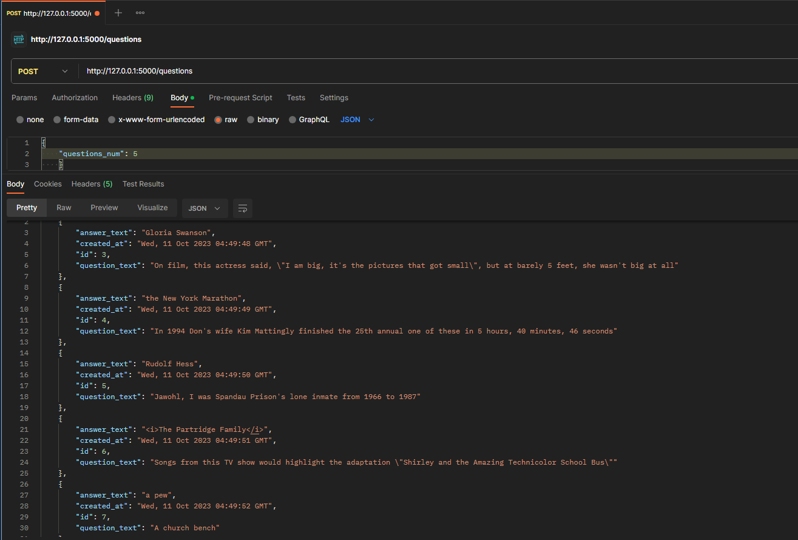

# quiz_questions

1. Клонирование проекта: git clone https://github.com/OlzhasKALIEV/quiz_questions.git
2. Создаем ВО: python -m venv venv
3. Запуск ВО: .\venv\Scripts\activate
4. Поднять сервер: docker-compose up

для входа в pgAdmin перейти по http://localhost:8080/browser/

1. Заходим под администратор: 
    логин: admin@example.com
    пароль: admin

2. Регистрация сервера: 

Register - Server
заполняем данные
General - Name - <любое имя>

Имя/адрес сервера: db-container
Порт: 5432
Служебная база данных: postgres
Имя пользователя: postgres
Пароль: 12345

Далее "Сохронить" или "Save"

Проект викторина вопросов. Сервис запрашивает с публичного API (англоязычные вопросы для викторин) https://jservice.io/api/random?count=1 указанное в полученном запросе количество вопросов. Далее полученный ответ сохраняет в БД (PostgreSQL)

для этого необходимо выполнить POST запрос JSON {"questions_num": integer} 

к примеру

POST: http://127.0.0.1:5000/questions

JSON = {"questions_num": 5} (скрин ответа ниже)

Postman: 

pgAdmin:

POST: http://127.0.0.1:5000/questions

JSON = {"questions_num": 2} (скрин ответа ниже)

pgAdmin:

